# LevelUP! Videogame Trivia 

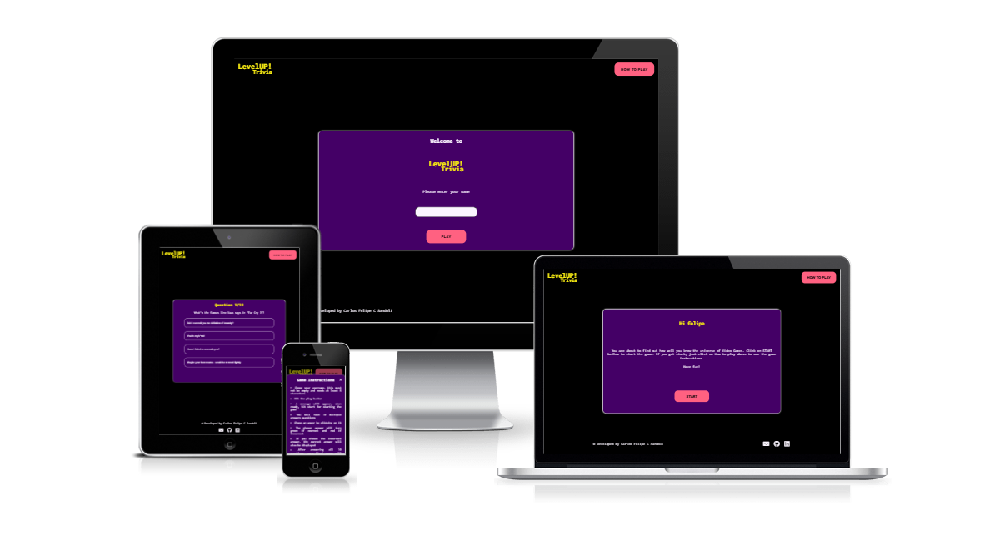

[Visit the live webpage](https://felipesandoli.github.io/trivia/)

Developed by: [Carlos Felipe Capobianco Sandoli](https://github.com/felipesandoli)

## Table of content

- [Project Overview](#project-overview)
    - [Project Goals](#project-goals)
    - [User Stories](#user-stories)
    - [Site Owner Stories](#site-owner-stories)
- [Design](#design)
    - [Colors](#colors)
    - [Fonts](#fonts)
    - [Wireframes](#wireframes)
- [Technologies](#technologies)
- [Features](#features)
    -[Header, Logo and Instruction Modal](#header-logo-and-instructions-modal)
    -[Game Stage](#game-stage)
    -[Footer](#footer)
    -[Contact Us Form](#contact-us-form)
- [Future Improvements](#future-improvements)
- [Testing](#testing)
    - [Validation](#validation)
        -[HTML Validation](#html-validation)
        -[CSS Validation](#css-validation)
        -[Accessibility Validation](#accessibility-validation)
    - [Manual Testing](#manual-testing)
- [Deployment](#deployment)
- [Credits](#credits)
    - [Modal](#modal)
    - [API](#api)
    - [HTML Data Attributes](#html-data-attributes)

## Project Overview

### Project Goals

The objective of the website is to provide a trivia quiz where the user can test their knowledge and learn more about videogames. Through a open trivia database, questions are random and different everytime the user plays the game.

### User Stories

- As a user, I want instructions on how to play the game.
- As a user, I want to play the game and test my knowledge.
- As a user, I want the game to display the correct answer when I get it wrong so I can improve my knowledge in the topic.
- As a user, I want to know how I performed in the quiz through a score system.
- As a user, I want to be able to send a feedback message to the site owner.
- As a user, I want to create a username to get a personalized message before starting the game.
- As a user, I want to be able to send my feedback to the site owner.

### Site Owner Stories

- As the site owner, I want to provide a fun game that is intuitive for the user.
- As the site owner, I want to provide a way for the user to get in touch.
- As the site owner, I want to allow the user to find my github and linkedin pages easily.
- As the site owner, I want the website to be fully responsive so the user can play it across multiple devices.

## Design

### Colors

The color palette was created using the color wheel palette generator from [Adobe Color](https://color.adobe.com/create/color-wheel).

### Fonts

The font Inconsolata, taken from Google Fonts was used for the body of the website.

### Wireframes

## Technologies

This project was developed using the following languages:

- HTML
- CSS
- JavaScript

The following tools were also used during development:

- Balsamiq
- Font Awesome
- Git
- Github
- Google Fonts
- Chrome Dev Tools
- [Favicon](https://www.favicon.cc/)

## Features

### Header, Logo and Instructions Modal

The header consists of a clickable logo that takes the user back to the home page and a how to play button that opens a modal where the instructions are displayed. The user can restart the game by clicking on the logo and also see the instructions from any point in the game.

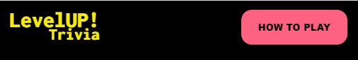

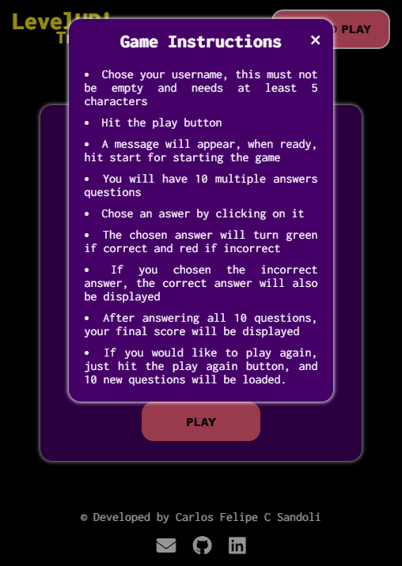

### Game Stage

When the page first loads, the user is presented a welcome window where they can enter their username.

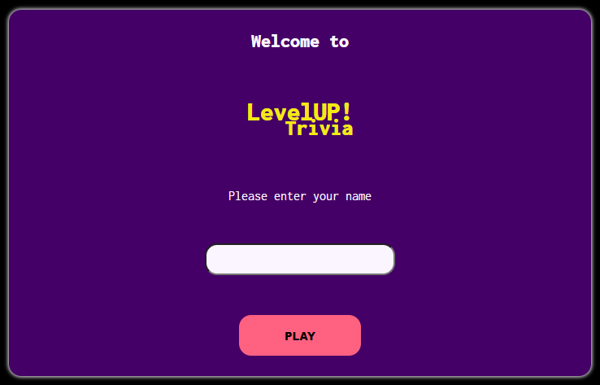

After entering their chosen username and clicking on the play button, second window with a greeting message will be displayed.

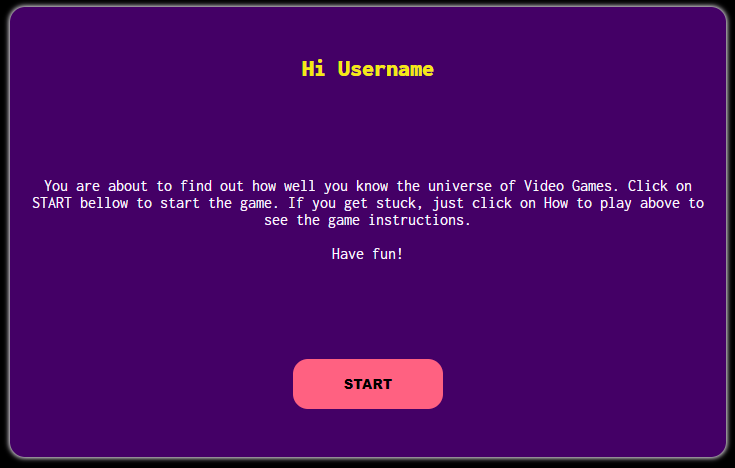

The user can then click on the START button to start the game. At this stage, the window will stay blank while the questions are loaded from the API. This is intentional as a visual representation of the loading time. After the questions are loaded, the first question will be displayed. The user can then chose one of the answers by clicking on it. If they get it right, the score is incremented and the answer button turns green, if they choose the wrong answer, the button turns red and the correct answer is also displayed. The next button is displayed after the question is answered.

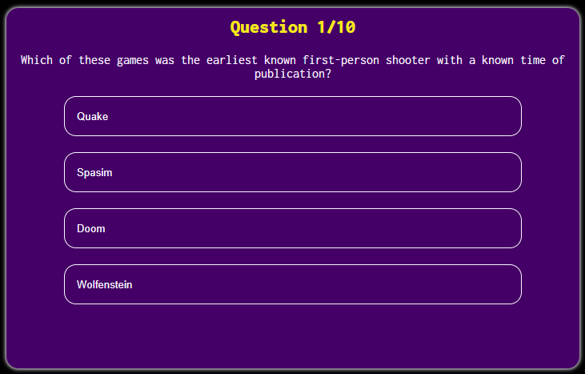 
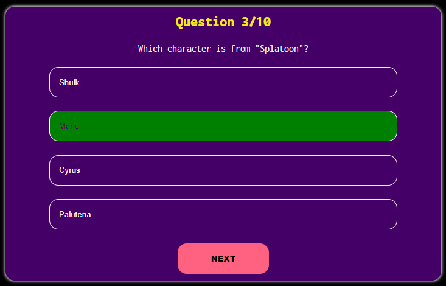
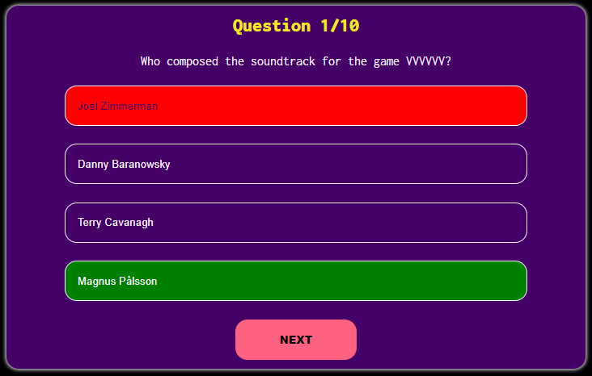

After answering the 10 questions. A final window is displayed, here the user will get a customized message depending on how well they went on the challenge, and they will also get their final score (how many questions they got right). The user can also start the game again with new questions by clicking on the PLAY AGAIN button.

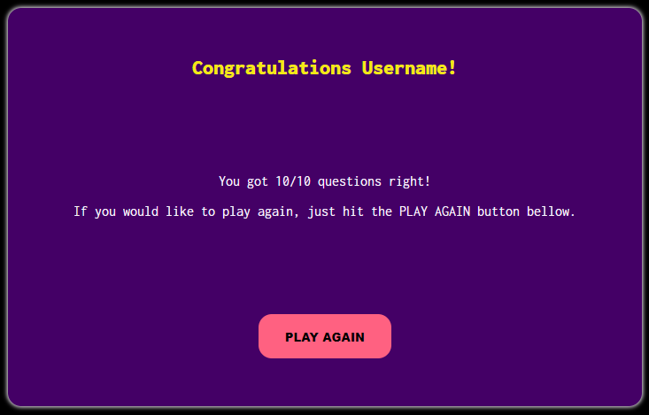
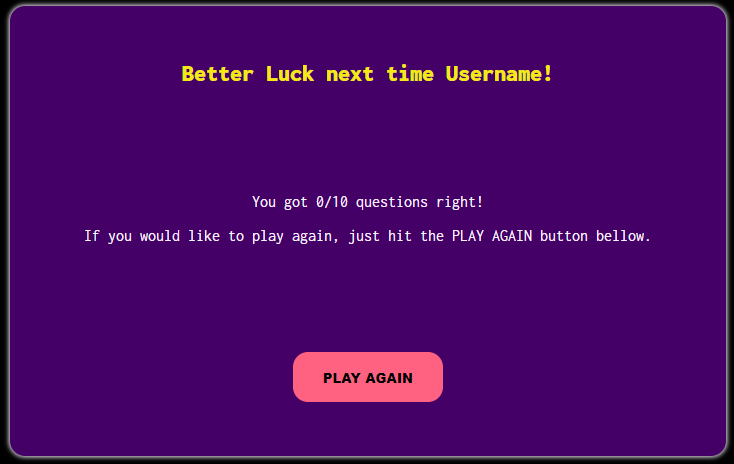

### Footer

The footer contains the credits to the site developer, links to the developer linkedin and github pages as well as a link to the contact us form

### Contact Us Form

The user can click on the message icon in the footer to access the contact form. They can fill this form to send a feedback, or give a suggestion for the site owner. Currently the form is sent to the From Dump by Code Institute.

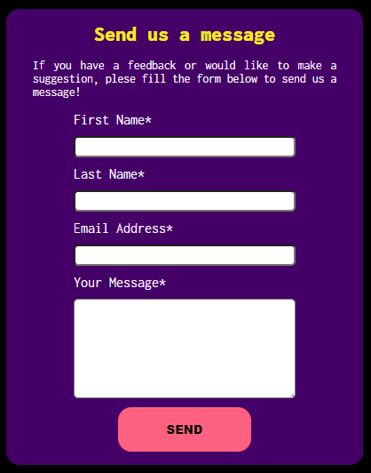

## Future Improvements

Future improvements to the site includes:

- A loading modal to be displayed while the questions are being loaded. At the moment the window stays blank.
- A timer to increase the challenge.
- Different difficulty levels which the user can choose (easy, medium, hard).

## Testing

### Validation

#### HTML Validation

The page was validated using the W3C Markup Validator. The first validation indicated a wrong heading structure and also indicated that the href url for the google fonts was broken down into two separate lines. When reestructuring the headings, the closing tags were left unchanged, this resulted in further errors. After fixing these, the page passed validation.

#### CSS Validation

WC3 Jigsaw Validator was used for validating CSS. No errors were found.

#### Accessibility Validation

Wave Accessibility Validator was used for ensuring all accessibility standards were followed. The first test showed a missing label for the username input and low contrast between the button background and text. Validation passed after fixing these.

#### JavScript validation

JSHint was used to validate the code in script.js. No major issues were found.

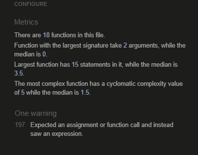

### Manual testing

## Deployment

This project was deployed through GitHub Pages. The following steps were followed for this:

- Navigate to the [repository](https://github.com/felipesandoli/trivia) in GitHub
- Select the settings tab
- On the left navigation menu, under Code and Automation, select Pages
- Select Deploy from a branch under source
- Select the main branch
- After the pages reload, the link to the deplyed page will show up at the top.

## Credits

### Modal

The modal containing the game instructions was created following a tutorial that can be found on [w3schools](https://www.w3schools.com/howto/howto_css_modals.asp)

### API

The questions displayed in the game were taken from the [OPEN TRIVIA DATABASE](https://opentdb.com/) API. A tutorial from [MDN](https://developer.mozilla.org/en-US/) was followed to write the code for getting the data from Open Trivia Database. The tutorial can be found on the following link: [MDN-fetch](https://developer.mozilla.org/en-US/docs/Web/API/Fetch_API/Using_Fetch).

### HTML Data Attributes

Data attributes elements were used for storing values to elements to be retrieved later in other functions. The Love Maths walkthrough project was used as inspiration for this.