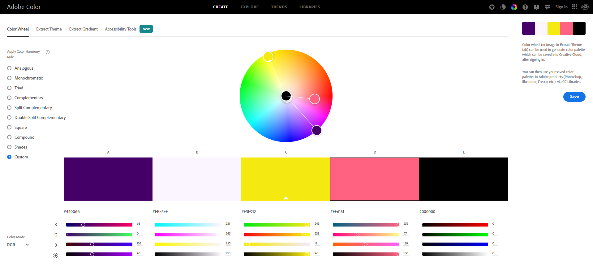

# Trivia 

[Visit the live webpage](#)

Developed by: [Carlos Felipe Capobianco Sandoli](https://github.com/felipesandoli)

## Table of content

- [Project Overview](#project-overview)
    - [Project Goals](#project-goals)
    - [User Stories](#user-stories)
    - [Site Owner Stories](#site-owner-stories)
- [Design](#design)
    - [Colors](#colors)
    - [Fonts](#fonts)
    - [Wireframes](#wireframes)
- [Technologies](#technologies)
- [Features](#features)
- [Testing](#testing)
    - [Validation](#validation)
    - [Manual Testing](#manual-testing)
- [Deployment](#deployment)
- [Credits](#credits)
    - [Modal](#modal)
    - [API](#api)

## Project Overview

### Project Goals

The objective of the website is to provide a trivia quiz where the user can test their knowledge and learn more about videogames. Through a open trivia database, questions are random and different everytime the user plays the game.

### User Stories

- As a user, I want instructions on how to play the game.
- As a user, I want to play the game and test my knowledge.
- As a user, I want the game to display the correct answer when I get it wrong so I can improve my knowledge in the topic.
- As a user, I want to know how I performed in the quiz through a score system.
- As a user, I want to be able to send a feedback message to the site owner.
- As a user, I want to create a username to get a personalized message before starting the game.
- As a user, I want to be able to send my feedback to the site owner.

### Site Owner Stories

- As the site owner, I want to provide a fun game that is intuitive for the user.
- As the site owner, I want to provide a way for the user to get in touch.
- As the site owner, I want to allow the user to find my github and linkedin pages easily.
- As the site owner, I want the website to be fully responsive so the user can play it across multiple devices.

## Design

### Colors

The color palette was created using the color wheel palette generator from [Adobe Color](https://color.adobe.com/create/color-wheel).

### Fonts

The font Inconsolata, taken from Google Fonts was used for the body of the website.

### Wireframes

## Technologies

## Features

## Testing

### Validation

### Manual testing

## Deployment

## Credits

### Modal

The modal containing the game instructions was created following a tutorial that can be found on [w3schools](https://www.w3schools.com/howto/howto_css_modals.asp)

### API

The questions displayed in the game were taken from the [OPEN TRIVIA DATABASE](https://opentdb.com/) API. A tutorial from [MDN](https://developer.mozilla.org/en-US/) was followed to write the code for getting the data from Open Trivia Database. The totorial can be found on the following link: [MDN-fetch](https://developer.mozilla.org/en-US/docs/Web/API/Fetch_API/Using_Fetch).